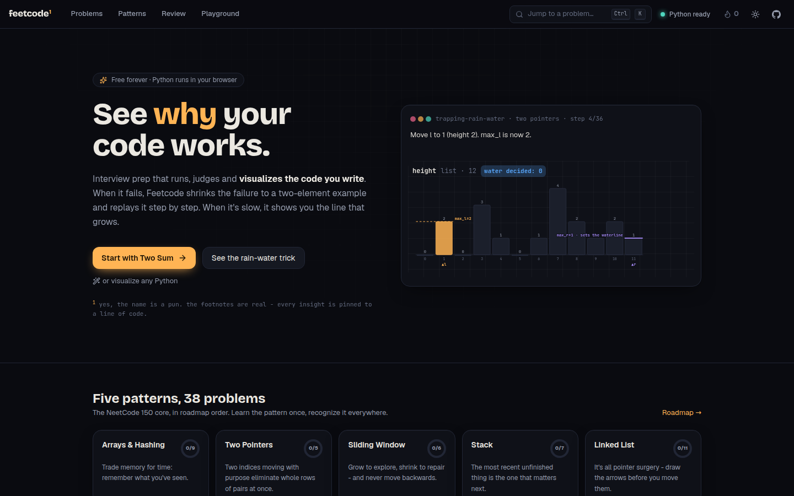
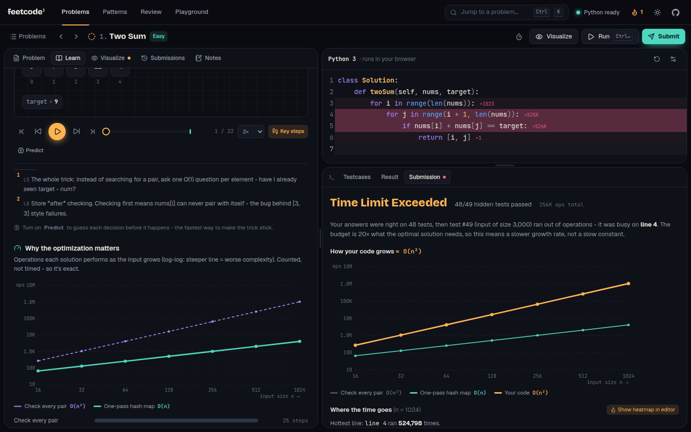
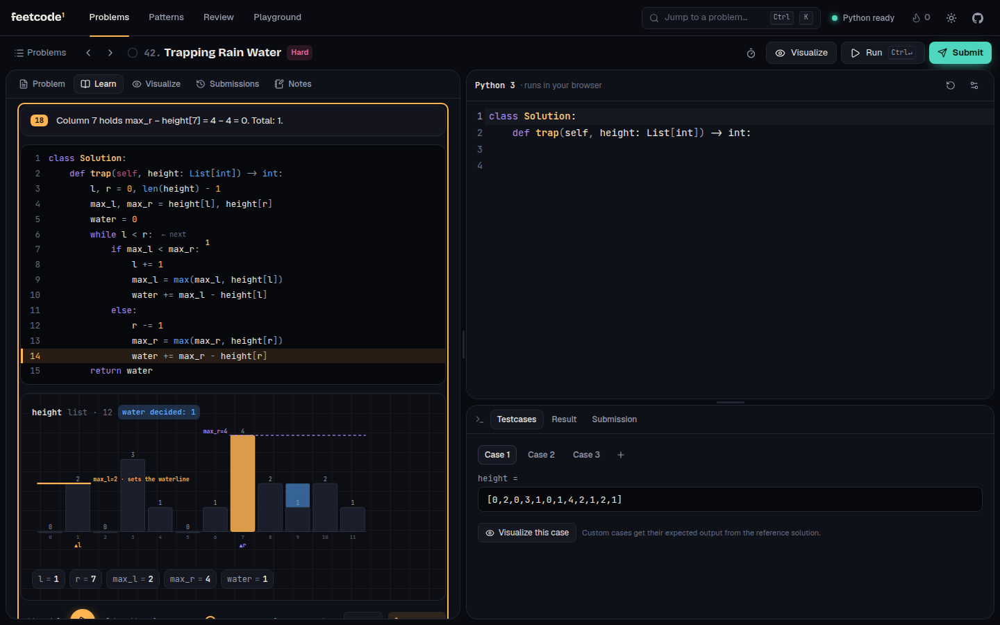
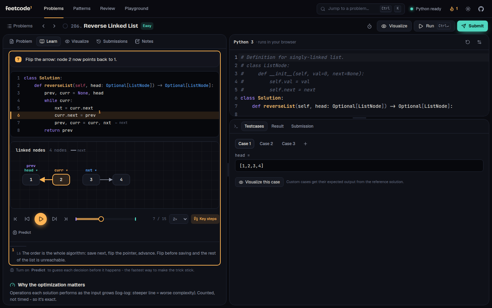

# feetcode¹

[](https://github.com/Tahmudun/Feetcode/actions/workflows/ci.yml)


**Interview prep that shows you _why_ your code works, or why it doesn't.** Write a solution and Feetcode runs, judges and **visualizes your own code**, not just the textbook answer. When your code is wrong, a fuzzer shrinks the failure to the smallest input that breaks it and replays it step by step. When it's too slow, you see which line grows and how fast. All free, with no account, and everything runs in your browser.

<sub>¹ yes, feet. the footnotes are real: every insight is pinned to a line of code.</sub>



---

## Why it exists

LeetCode tells you *that* you failed. NeetCode shows you a video of *someone else's* code. Neither shows you **your** code: the input that breaks it, the line where it goes wrong, or the loop that makes it slow. Feetcode points real program-analysis tools at the code you typed:

| You did this | Feetcode does this |
| --- | --- |
| Submitted a wrong answer | **Fuzzes** your code against the reference, **shrinks** the failure to a minimal input (often 2 elements), names the **likely mistake**, and lets you **watch it fail** line by line. |
| Got Time Limit Exceeded | **Counts operations** at growing input sizes, fits a growth curve (`O(n²)`), shows it next to the brute-force and optimal curves, and **heat-maps the hot lines** in your editor. It also flags hidden costs such as `x in list` or `list.pop(0)`. |
| Solved it, but don't get *why* it works | **Narrated lessons** for every solution, from brute force to optimal, with problem-specific overlays: water levels for Trapping Rain Water, rectangles for Container With Most Water, a cycle graph for Find the Duplicate. **Predict mode** quizzes you before each decision. |
| Forgot it two weeks later | **Spaced repetition** brings problems back on a schedule, and the cards test the *insight* ("why check the map before inserting?") rather than the code. |

### Watch your bug happen

![A wrong Two Sum: the fuzzer shrinks the failure to nums=[5,5], names the pitfall, and replays it](docs/media/failure.png)

### See why it's slow



### Understand the trick, don't memorize it

| Trapping Rain Water: *the lower wall decides* | Reverse Linked List: *nodes stay put, arrows flip* |
| --- | --- |
|  |  |

## Features

**Practice**
- **38 problems**: the NeetCode 150 core for *Arrays & Hashing, Two Pointers, Sliding Window, Stack* and *Linked List*, in roadmap order. Each one has hidden test suites, edge cases and stress tests.
- **Company tags** with a frequency score, plus a company filter and sort.
- A **CodeMirror 6** editor with Python highlighting, optional **Vim mode**, a timer, notes, submission history, a command palette (`Ctrl K`), and `Ctrl Enter` / `Ctrl Shift Enter` / `Ctrl .` to run / submit / visualize.
- **Deterministic judging**: limits are counted in *operations*, not milliseconds, so the same code gets the same verdict on any laptop.

**Understand**
- A **visualizer for any code**, including your own: arrays with pointers and sliding windows, hash maps showing which key was probed, stacks, deques, grids, sets, linked lists and random-pointer graphs with a stable layout.
- **Lessons** for every solution: authored narration on each step and footnotes pinned to the key lines.
- **Auto-narration** for code nobody annotated. It describes what each line *did* ("condition is False → skip · 7 in seen? no"), not what the code says.
- **Predict mode**: the player pauses before each branch and asks what happens next.
- A **complexity lab** that plots growth curves (ops vs n, log-log) for every solution and for your own code.
- A **playground** that visualizes any Python snippet, shareable as a URL.

**Remember**
- **Pattern primers** with a reusable template for each pattern.
- **Spaced repetition** (SM-2-style) review cards built from each problem's insight.
- **Streaks, a heat map and mastery per pattern.**
- Your whole history is an **event log** you can export as NDJSON and query in DuckDB.

## How it works

```mermaid
flowchart LR
  subgraph build["Build time · Python pipeline"]
    P["problems/*.py<br/>problems as code"] --> Q["quality gate<br/>examples · cross-checked references<br/>narration · pitfalls · complexity"]
    Q --> B["deterministic, incremental build<br/>sha256 manifest · --check drift"]
  end
  B -->|static JSON| C
  subgraph browser["Run time · 100% in the browser"]
    C["React UI"] <-->|JSON| W["Web Worker"]
    W --> PY["Pyodide<br/>CPython → WebAssembly"]
    PY --> E["feetcode engine<br/>tracer · meter · judge · fuzzer · profiler"]
  end
  E -. same .py files .- P
```

The **same Python engine** (`engine/feetcode`) runs in two places:

1. **At build time**, under CPython, the pipeline uses it to validate every problem, run every reference solution, record the lesson traces and compute baseline growth curves.
2. **In the browser**, under Pyodide, a Web Worker uses it to judge, fuzz, trace and profile *your* code.

Vite inlines the engine's `.py` files into the worker bundle. Both runtimes execute byte-for-byte the same analysis code, and CI runs the engine's test suite in both.

### The engine in one paragraph

A `sys.settrace` **tracer** records one *snapshot* per executed statement: the full call stack, plus a heap that preserves object identity, so two pointers to the same node draw as one node with two arrows. It also records which elements each line *touched*, using AST "line facts" such as subscripts, `in` probes and attribute writes. A **meter** counts one operation per line, plus a size-weighted cost for hidden linear work (`in` on a list, `pop(0)`, slicing, `sorted`). Op budgets make the **judge** deterministic. The **fuzzer** generates inputs from each problem's generator, diffs your output against the reference, then **greedily shrinks** the failing input while keeping it valid. The **profiler** runs worst-case inputs at growing `n` and fits `O(1) … O(2ⁿ)` by weighted least squares. Space is fitted from tracemalloc and recursion depth. Details: [docs/ARCHITECTURE.md](docs/ARCHITECTURE.md).

## Engineering highlights

**For software engineering readers**
- **Deterministic judging.** Time limits are operation budgets (20 × the optimal solution's ops for that case), not wall-clock timeouts. Verdicts are reproducible across machines and complexity curves have no noise. The budget exception subclasses `BaseException`, so `except Exception:` in user code can't swallow it. [ADR 0001](docs/adr/0001-deterministic-operation-budgets.md)
- **One engine, two runtimes.** CPython 3.12+ at build time and Pyodide (CPython 3.14 on WebAssembly) in the browser, running identical code. The engine test suite runs under both. [ADR 0002](docs/adr/0002-one-engine-two-runtimes.md)
- **Snapshot traces, pure renderer.** Each step is a complete state, so `scene = buildScene(trace, i)` is a pure function, scrubbing is free, and any two traces can be compared step by step. [ADR 0003](docs/adr/0003-snapshot-traces.md)
- **Property-based testing with shrinking**, in the style of QuickCheck and Hypothesis, applied to the user's code. Shrinking respects each problem's input validity, so the minimal counterexample is still a legal input.
- **No server, no sandbox fleet.** User code runs in a Web Worker. A watchdog terminates and reboots the worker if code hangs, so the page never freezes. [ADR 0007](docs/adr/0007-self-hosted-pyodide.md)
- **A typed, tested client.** React 19, TypeScript strict, zustand, Tailwind v4 design tokens, container queries, and keyboard and `prefers-reduced-motion` support. Tests: Vitest unit tests, plus Playwright end-to-end tests that drive the real Pyodide runtime.

**For data engineering readers**
- **Content as code with a quality gate.** Each problem is a Python module: statement, generators, validators, multiple reference solutions, pitfalls and lens. A build fails if references disagree, an example's stated output is wrong, a narration template doesn't render, a pitfall detector fires on a correct answer, or a measured complexity contradicts the declared one. [ADR 0004](docs/adr/0004-content-as-code.md)
- **A deterministic, incremental, parallel build.** A process pool builds only what changed. A manifest keys each problem on sha256 of its source plus the engine plus the pipeline version, and the output is canonical JSON, so a rebuild changes **0 bytes**. `build --check` fails CI on drift, like a dbt `state:modified` check for content. [ADR 0005](docs/adr/0005-deterministic-incremental-pipeline.md)
- **Lineage.** The manifest records which engine digest and pipeline version produced each artifact.
- **Event-sourced user state.** Progress is an append-only log of immutable events. Status, streaks, mastery and review schedules are *derived* by a pure fold, so they are replayable, exportable as NDJSON and queryable in DuckDB. [ADR 0006](docs/adr/0006-event-sourced-progress.md)

## The problems

| Pattern | Problems |
| --- | --- |
| **Arrays & Hashing** (9) | Contains Duplicate · Valid Anagram · Two Sum · Group Anagrams · Top K Frequent Elements · Encode and Decode Strings · Product of Array Except Self · Valid Sudoku · Longest Consecutive Sequence |
| **Two Pointers** (5) | Valid Palindrome · Two Sum II · 3Sum · Container With Most Water · Trapping Rain Water |
| **Sliding Window** (6) | Best Time to Buy and Sell Stock · Longest Substring Without Repeating Characters · Longest Repeating Character Replacement · Permutation in String · Minimum Window Substring · Sliding Window Maximum |
| **Stack** (7) | Valid Parentheses · Min Stack · Evaluate Reverse Polish Notation · Generate Parentheses · Daily Temperatures · Car Fleet · Largest Rectangle in Histogram |
| **Linked List** (11) | Reverse Linked List · Merge Two Sorted Lists · Linked List Cycle · Reorder List · Remove Nth Node From End · Copy List With Random Pointer · Add Two Numbers · Find the Duplicate Number · LRU Cache · Merge K Sorted Lists · Reverse Nodes in K-Group |

Every problem ships with a brute-force and an optimal solution (sometimes more), each with narration and a measured growth curve. It also includes hints, an insight card with recall questions, pitfalls the diagnosis engine can recognize, related problems and company tags. Statements are written from scratch.

## Repository layout

```
engine/feetcode/      The analysis engine (pure Python, no dependencies) - runs in CPython and Pyodide
  tracer.py           sys.settrace → snapshot steps (stack + identity-preserving heap + accesses)
  meter.py            deterministic op counting and budgets
  analysis.py         AST line facts, hidden-cost probes, safe evaluator, #> / #! / #~ directives
  judge.py fuzz.py    run / submit, fuzz → shrink → pitfalls → neighbour
  complexity.py       growth-model fitting for time, space and recursion depth
  api.py              JSON in, JSON out - the whole browser contract
problems/<pattern>/   38 problems as code (statement, generators, solutions, pitfalls, lens)
pipeline/             quality gate + deterministic incremental build → client/src/content/generated
client/               React 19 + TypeScript app
  src/runtime/        Pyodide worker, protocol, watchdog
  src/viz/            scene builder, renderers, overlays, auto-narration, playback
  src/features/       workspace, problems, patterns, review, stats, playground, home
  src/store/          event-sourced progress (SM-2-lite scheduling, streaks, mastery)
  e2e/                Playwright tests against real in-browser Python
docs/                 architecture, ADRs, trace format, authoring guide
```

## Development

Requirements: **Node 22+** and **Python 3.12+** (3.11 is not supported because it emits no line event for `while True: pass`).

```sh
# client
cd client
npm install
npm run dev            # http://localhost:5173 - Pyodide is served from node_modules
npm run build          # typecheck + production build (copies Pyodide into dist/)
npm run lint

# content pipeline
cd pipeline
python -m feetcode_pipeline check              # quality gate for every problem
python -m feetcode_pipeline check two-sum      # ... or a subset (substring or pattern dir)
python -m feetcode_pipeline check --complexity # ... plus measured vs declared big-O (what CI runs)
python -m feetcode_pipeline build              # incremental: rebuilds only what changed
python -m feetcode_pipeline build --check      # fail if generated artifacts are stale
```

Adding a problem means writing one Python module and running the build. See [docs/authoring.md](docs/authoring.md).

## Testing

| Suite | What it covers | Command |
| --- | --- | --- |
| Engine (pytest) | tracer normalization, identity, accesses, meter, judge, fuzz/shrink, complexity fitting | `python -m pytest -q engine/tests` |
| Engine in WebAssembly | the **same** pytest suite, run inside Pyodide under Node | `cd client && npm run test:engine` |
| Pipeline (pytest) | discovery, starter code, deterministic suites and budgets, canonical JSON, the gate catching planted bad content | `cd pipeline && python -m pytest -q tests` |
| Content gate | all 38 problems: examples, reference agreement, narration, pitfalls, complexity | `cd pipeline && python -m feetcode_pipeline check` |
| Client unit (Vitest) | scene builder, event-sourced progress, SRS scheduling, streaks | `cd client && npm test` |
| End-to-end (Playwright) | boots real Pyodide; run, submit, diagnose, visualize, lessons, playground | `cd client && npm run e2e` |

CI ([`.github/workflows/ci.yml`](.github/workflows/ci.yml)) runs all of these: the engine on Python 3.12 and 3.13, the content gate with a drift check, client lint, typecheck, unit tests and build, the engine-in-Pyodide suite, and Playwright.

## Deploying

The output is a static site. [`netlify.toml`](netlify.toml) builds `client/` and serves `dist/` with immutable caching for the versioned Pyodide assets and an SPA fallback. Any static host works.

`npm run build:artifact` builds a variant that runs from **any URL**: relative asset URLs, routes kept in memory instead of the address bar (the last page survives a reload), and `index.html` reduced to a page fragment. It also ships Python's standard library as JSON instead of a `.zip`, since some hosts refuse archives. It's meant for hosts that own the URL or can't rewrite paths, such as a claude.ai Artifact, an iframe or a sub-folder, and is written to `client/dist-artifact/`.

## Roadmap

- **Divergence finder**: trace your code and the reference on the minimal failing input, then jump to the first step where their states differ.
- **Invariant mining**: learn invariants like `l ≤ r` or "the window has no duplicates" from reference traces, then flag the step where your code breaks one.
- **Approach fingerprinting**: classify *how* you solved it (two pointers vs hash map) from trace dynamics, not source text.
- The rest of the NeetCode 150: binary search, trees, tries, heaps, backtracking, graphs, DP.
- Optional sync of the event log across devices (the log is already the sync format).

## Notes

- Company tags are **curated estimates** of how often each problem is reported in interviews. They are a study-priority signal, not scraped data.
- Problem statements are original paraphrases. Problem names and numbers refer to the well-known canonical problems so you can cross-reference them.

## License

[MIT](LICENSE)
