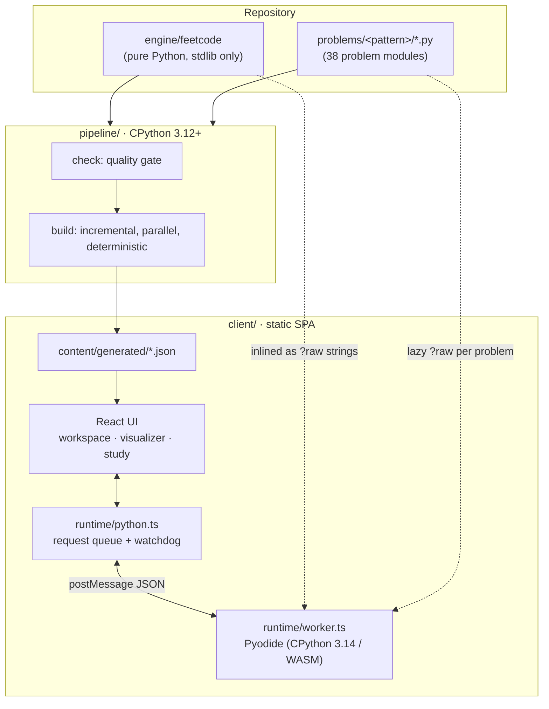

# Architecture

Feetcode has three parts that share one Python engine:



| Part | Runs where | Job |
| --- | --- | --- |
| **engine** | CPython (build) and Pyodide (browser) | Trace, meter, judge, fuzz, shrink and profile Python code. JSON in, JSON out. |
| **pipeline** | CPython, at build time and in CI | Validate every problem, then emit the static artifacts the client needs. |
| **client** | Browser | UI and visualizer. Owns a Web Worker that hosts Pyodide and the engine. |

Nothing runs on a server. The deploy is a directory of static files.

---

## 1. The engine (`engine/feetcode`)

The engine is plain Python with no third-party dependencies. It must run unchanged in CPython 3.12+ and in Pyodide.

```
api.py         handle(json) -> json: ping · run · submit · trace · compare · profile · diagnose · playground
problem.py     Problem / Signature / Solution / Pitfall, comparators, shrink_args, generator helpers
harness.py     compile user code, build a fresh namespace, adapt args (ListNode, design ops, codecs)
structures.py  ListNode / Node, list <-> linked-list conversion, CallArgs (in-place problems)
analysis.py    AST "line facts", hidden-cost probes, safe_eval, narration directives
meter.py       deterministic op counting + budgets (BudgetExceeded is a BaseException)
tracer.py      sys.settrace -> snapshot steps
values.py      identity-preserving value/heap encoder
judge.py       run (visible cases) and submit (hidden suite -> fuzz -> diagnose -> profile)
fuzz.py        find_failure, greedy shrink, pitfall matching, passing neighbour
diverge.py     first divergence from the closest reference run, mined invariants
complexity.py  sizes -> ops / memory / depth -> best-fitting growth model
```

### 1.1 Line facts: what each line *can* do

Before anything runs, `analysis.Program` parses the user's source once and records facts per line:

- **Accesses**: subscripts (`nums[i]`), membership tests (`x in seen`), method calls on containers (`stack.append`, `q.popleft`, `heapq.heappush`) and attribute writes (`curr.next = prev`). The tracer evaluates these expressions *after* the line runs, using `safe_eval`, a restricted evaluator with no calls and no side effects. That tells it which cell was compared, which key was probed and whether the probe hit, and which edge was rewired.
- **Branch targets**: for `if`/`while`/`for` headers, the line that starts the body. The tracer compares it with the next line actually executed, so every branch step carries `b: 1` (entered) or `b: 0` (skipped).
- **Hidden-cost probes**: work that one Python line hides. `x in some_list` (`member`), `list.pop(0)` (`pop`), `sorted(...)` (`sort`), slicing (`slice`), string or list concatenation (`concat`), `len(str)` (`strlen`) and walking a linked list (`walk`). The meter charges these by size, so `if x in seen_list` is correctly O(n) per call.
- **Statement spans** and **comprehension lines**: used to normalize CPython's line events (below).

### 1.2 The tracer

`sys.settrace` delivers `call` / `line` / `return` / `exception` events. A `line` event fires *before* a line runs, but a visual step should show the state *after* it ran. So the tracer emits the step for line *L* when the next event in that frame arrives.

Two CPython quirks are normalized:

- A multi-line statement reports as `3, 4, 3`. Every event inside one statement's span is collapsed into one step.
- Since 3.12, comprehensions are inlined and report one event per iteration on the same line. These also collapse into the statement's single step. Genuine one-line loops (`while x: x -= 1`) still get one step per iteration.

Each step is a **complete snapshot**: the user's call stack plus a heap of every reachable container and object, encoded with stable ids so object identity survives. See [trace-format.md](trace-format.md) for the format and [ADR 0003](adr/0003-snapshot-traces.md) for why.

Reference solutions carry **directives** in comments:

| Directive | Meaning |
| --- | --- |
| `#> text with {expr}` | Narration for this line's step. `{expr}` is evaluated in the frame and repr-formatted; `{!expr}` inserts raw. `_return` and `_taken` are in scope. |
| `#> if-text \|\| else-text` | Branch-aware narration: the first part when the branch is taken, the second when not. |
| `#! text` | A footnote pinned to this line. |
| `#~` | Hide this step in lesson mode (it still runs). |

The pipeline renders every template in **strict mode**: a narration that fails to evaluate fails the build.

### 1.3 The meter and the judge

`Meter` is a lighter trace function: one op per executed line in user code, plus probe costs. When `ops > budget` it raises `BudgetExceeded`, a `BaseException`, so `except Exception:` in user code can't swallow it. ([ADR 0001](adr/0001-deterministic-operation-budgets.md))

`judge.submit` runs in this order:

1. **Hidden suite.** Every case runs with a budget of `max(25 000, 20 × the optimal reference's ops on that case)`. The pipeline precomputes these budgets and ships them with the suite. Outputs are checked with the problem's comparator: `exact`, `unordered`, `unordered_nested`, `float`, or a custom callable.
2. **On failure: diagnose.** `fuzz.diagnose` takes the failing case, or one the fuzzer finds, and **shrinks** it greedily. It repeatedly tries "smaller" candidates and keeps any that still fail *and* still pass the problem's `validate()`. The minimal input is matched against the problem's **pitfalls**. A pitfall can match on output shape (`detect`), on an exception (`error="IndexError: list index"`) or on a source regex (`code`). The diagnosis also finds a **passing neighbour**: an input one small edit away that your code gets right. If the minimal input is small (n ≤ 40), it is traced so the UI can offer *Watch it go wrong*, and `diverge.analyze` compares that trace with the references' (§1.5).
3. **If every case passes: fuzz.** 150 random small inputs are checked against the reference. A hidden test suite can miss a bug; a fuzzer is less likely to.
4. **On accept or TLE: profile.** See below.

### 1.4 The profiler (`complexity.py`)

The profiler runs the problem's `worst_case(n)` (or its generator) at growing `n` until a size or op cap is hit. At each size it records:

- **ops** from the meter (deterministic)
- **auxiliary memory**: tracemalloc's peak minus the memory still held at return, so the returned output isn't counted against you
- **recursion depth**

Time is fitted against `O(1), O(log n), O(n), O(n log n), O(n²), O(n² log n), O(n³), O(2ⁿ)` by weighted least squares on the upper five points, preferring the simpler model when errors are close. Memory is noisier: allocator granularity differs between 64-bit CPython and 32-bit WebAssembly. So space is classified by its log-log slope, and points below a 2 KiB floor are dropped rather than clamped. Per-line hit counts and probe costs become the editor heat map and the "hidden cost" findings.

### 1.5 The divergence finder (`diverge.py`)

A wrong answer says *that* your code is wrong. The divergence finder says *where*: the first step at which your run stops agreeing with a correct one on the same input.

1. **Histories.** For the outermost frame of each trace, record every variable's value history: the steps at which it changed and the value it took. Values are canonicalised structurally (heap refs resolved, dicts and sets order-insensitive), so two runs can be compared even though their object identities differ.
2. **Pick the closest reference.** Each reference solution is traced on the same input. Only variables both runs share count, and only if their first values have the same type (so a `seen` dict and a `seen` set aren't compared). The reference whose histories match yours for the most changes is the one you were writing.
3. **Walk in lockstep.** The shared histories are walked change by change. The first mismatch is the divergence: a different value (`value`), a change the reference never makes (`extra`), a change you never make (`missing`), a different return value (`return`), or a crash (`error`). If nothing mismatches, the runs `agree`. A truncated trace stops the walk (`unknown`) rather than inventing a divergence.
4. **Mine invariants.** A light recorder runs the reference on the failing input plus a dozen generated ones and keeps the facts that held every time: an integer that never decreases or never increases, and `a ≤ b` for pairs the reference's source actually compares. The first such fact your run breaks is reported with the divergence ("in the reference, `l` never decreases").

The result names the step, line, variable, both values and the reference's step, so the client can pin a footnote under the guilty line, jump the player there, and show the reference's run from the matching point. It never says how to fix the code; it states what differs. Design and codec problems, and runs that share no variable names with any reference, get no divergence. The `compare` op runs the same analysis for any case the user visualizes.

---

## 2. Problems as code (`problems/`)

A problem is a Python module that defines `PROBLEM = Problem(...)`:

- statement (Markdown), examples, constraints, hints, company tags, related problems
- a **signature**: `function`, `design` (Min Stack, LRU Cache: a list of operations), or `codec` (Encode/Decode)
- **generators**: `generate(rng, n)` for random inputs and `worst_case(n)` for profiling, plus `validate(args)` and an optional custom `shrink`
- **solutions**: brute force to optimal, each with declared complexity and narrated with directives
- **pitfalls**: named, common mistakes with detectors
- **insight**: the one-liner, mnemonic, "why it works", recognition signals and recall questions for spaced repetition
- **lens**: hints for the visualizer (see §4)

See [authoring.md](authoring.md) for a walkthrough, and [ADR 0004](adr/0004-content-as-code.md) for why problems are code rather than JSON or LLM output.

---

## 3. The pipeline (`pipeline/feetcode_pipeline`)

```
discover → check (quality gate) → build stages → canonical JSON → manifest
```

**Quality gate (`validate.py`).** Every problem must pass:

| Check | Fails when |
| --- | --- |
| schema | bad id or pattern, no examples, not exactly one optimal solution, duplicate solution ids, missing insight fields, unknown lens keys, a solution that doesn't compile |
| examples | a stated example output disagrees with a reference, or an example or edge case violates `validate()` |
| agreement | the reference solutions disagree with each other on generated inputs |
| lessons | a narration template fails to render in strict mode |
| pitfalls | a pitfall detector fires on a *correct* answer (a false positive would blame correct code) |
| complexity | the measured growth contradicts a solution's declared big-O |

**Stages (`stages.py`).** Each problem produces:

- `problems/<id>.json`: statement, starter code, solutions, pitfalls, insight, lens
- `suites/<id>.json`: hidden cases (example / edge / random / large / stress, from deterministic seeds) with expected outputs and per-case op budgets
- `lessons/<id>.json`: one narrated trace per solution
- `baselines/<id>.json`: measured growth curves for each solution

These roll up into `catalog.json`, `patterns.json` and `companies.json`.

**Determinism and incrementality (`build.py`).** The manifest stores, per problem, a sha256 of the problem's source, the engine digest (all engine files) and `PIPELINE_VERSION`. A build rebuilds only stale problems, in a process pool. Output JSON is canonical (sorted keys, fixed separators), so an unchanged input yields byte-identical output. `build --check` exits non-zero if anything would change, and CI uses it to catch committed artifacts that drifted from their sources. ([ADR 0005](adr/0005-deterministic-incremental-pipeline.md))

---

## 4. The client (`client/src`)

```
runtime/   worker.ts (Pyodide + engine), python.ts (queue, watchdog, restart), engine.ts (typed ops)
content/   lazy loaders for generated JSON (one chunk per problem)
viz/       decode → scene → panels;  overlays, auto-narration, playback, CodePane, ComplexityChart
features/  workspace, problems, patterns, study (review, stats), playground, home, session (tonight's plan, path)
store/     event log + derived progress (zustand)
editor/    CodeMirror 6 wrapper with trace/error/heat/note decorations
ui/        primitives, SplitPane, Markdown, Heatmap, confetti
styles/    index.css: all color/typography tokens, light + dark, .st-* state classes
```

### 4.1 Runtime

`worker.ts` boots Pyodide from the self-hosted, versioned path `/pyodide/v<version>/` ([ADR 0007](adr/0007-self-hosted-pyodide.md)). It then writes the engine's `.py` files (bundled as strings via `import.meta.glob(..., { query: "?raw" })`) into Pyodide's in-memory filesystem and imports `feetcode.api`. Problem modules are mounted lazily, the first time a request names one.

`python.ts` runs one request at a time with a per-op wall-clock **watchdog**. Op budgets catch slow code, but a watchdog is still needed for code that never yields: a C-level loop, or a huge allocation. On timeout the worker is terminated and a fresh one boots. The UI shows the restart, and the page never freezes.

### 4.2 Visualizer

The visualizer works on the same principle as the trace: **the renderer is a pure function of one step**.

1. `decode.ts` turns encoded values and heap refs into display values.
2. `scene.ts`: `buildScene(trace, i, ctx)` → panels. A panel is an array (cells, pointers, window), bars, chars, grid, map, set, stack, linked graph or object. Panel types come from the heap object types, refined by the problem's **lens**:
   - `arrays.<name>.view`: `"bars"` for heights or prices, `"chars"` for strings
   - `arrays.<name>.pointers`: which integer variables are indices into this array
   - `arrays.<name>.window`: two lens expressions (e.g. `["r - k + 1", "r"]`) evaluated per step by `expr.ts`, a tiny safe expression evaluator
   - `maps.<name>.key`: compact key renderers (e.g. `letter-counts`)
   - `indexes`: a container that holds *indices into* another (a monotonic deque of indices over `nums`)
   - `overlay`: `water`, `container`, `histogram`, `index-graph`
   - `stacks`, `grids`, `nodes`, `hide`

   Code without a lens (your own code, the playground) still gets panels from heuristics. Integer locals within an array's bounds become pointers, and lists of lists become grids.
3. **Accesses** from the step set cell states: `compare`, `active`, `match`, `new`, `done`. The CSS maps each state to a look in exactly one place (`.st-*` in `index.css`).
4. **Overlays** (`overlays.ts`) compute derived geometry from the step alone. For the water overlay that means the water above each column, which columns are decided so far, the `max_l` / `max_r` levels and which one is the bottleneck.
5. **Linked structures** (`graph.ts`) get a stable layout. A node's position is fixed the first time it appears, next to an already-placed neighbour, so when `curr.next = prev` runs only the arrow moves. Copied nodes line up under their originals. Doubly linked lists use a flow layout that is recomputed each step, so moving a node to the front visibly slides it. Random pointers draw as arcs.
6. **Narration**: authored (`t`) for lessons; otherwise `narrate.ts` builds it from branch outcomes, accesses and the snapshot diff.
7. `usePlayback.ts` drives the timeline: play/pause, speed, "every line" vs "key steps", and a **gate** that Predict mode uses to stop before each branch until the user answers.
8. **In the editor.** `inline.ts` turns the current step into values shown at the end of the lines that assigned them (`l = 1, best = 2`, `returns 3`, `→ True`). `tracks.ts` turns the whole trace into one row per variable, a segment for each stretch of steps over which it held one value, so a wrong value is visible at a glance; a divergence adds a marker across every row and a dashed lane with the reference's value. Both are pure functions of the trace.

### 4.3 Study state

Progress is an append-only list of events in `localStorage` (`fc:events:v1`): `run`, `submit`, `lesson`, `review` and so on. `derive(events)` folds them into per-problem status, best complexity, mastery, SM-2-lite review cards, streaks and an activity heat map. The derived state is never stored. The log exports and imports as NDJSON. ([ADR 0006](adr/0006-event-sourced-progress.md))

**Tonight's session** (`store/session.ts`) sits on the same log. `planSession(progress, …)` is a pure function that proposes a short plan in the order to do it: up to three due recall cards as a warm-up, the problem you most recently left broken, the next new problem in the pattern you're working in, and, once that pattern is at least 70% solved, a stretch problem from a pattern that builds on it (`content/roadmap.ts`). At most five items. Starting the session logs one `session` event holding the plan, because the plan is a decision, not derived state. `sessionState(events)` then folds the events that follow it into each item's status (todo, started, done) for as long as the day lasts. The home page, the header's session pill and the accepted-submit view all read that one derived value.

**The path** (`features/session/path.ts`) lays every problem out as a star and every pattern as a constellation: columns by roadmap depth, constellation shapes from a PRNG seeded with the pattern id, so the layout is deterministic and never moves. Stars light up when solved and grow with mastery; tonight's items pulse.

---

## 5. Testing strategy

| Layer | How |
| --- | --- |
| Engine | pytest: tracer normalization on tricky control flow, identity, access recording, meter and budgets, judge verdicts, shrinking minimality, growth fitting. CI runs it on CPython 3.12 and 3.13 **and inside Pyodide** (`client/scripts/engine-in-pyodide.mjs`), because "same engine in two runtimes" has to be tested, not assumed. |
| Content | The quality gate *is* the test suite for the 38 problems. CI runs it on every push, plus `build --check`. |
| Pipeline | pytest: discovery, starter code for each signature kind, deterministic suites and budgets that separate complexity classes, canonical JSON, and the gate catching planted bad content (a wrong example, disagreeing solutions, a trigger-happy pitfall). |
| Client | Vitest on the pure parts: the scene builder (against real traces from the generated lessons), inline values and tracks, divergence footnotes, progress derivation, scheduling, streaks, the session planner and session state, the path layout. |
| End-to-end | Playwright against a production build, booting real Pyodide: run, submit (wrong → shrink → pitfall → divergence footnote → replay; TLE; accepted), visualize with the reference's run, lessons with Predict mode, the playground, an infinite loop that the op budget stops cleanly, and a whole session from the home page to done. |
